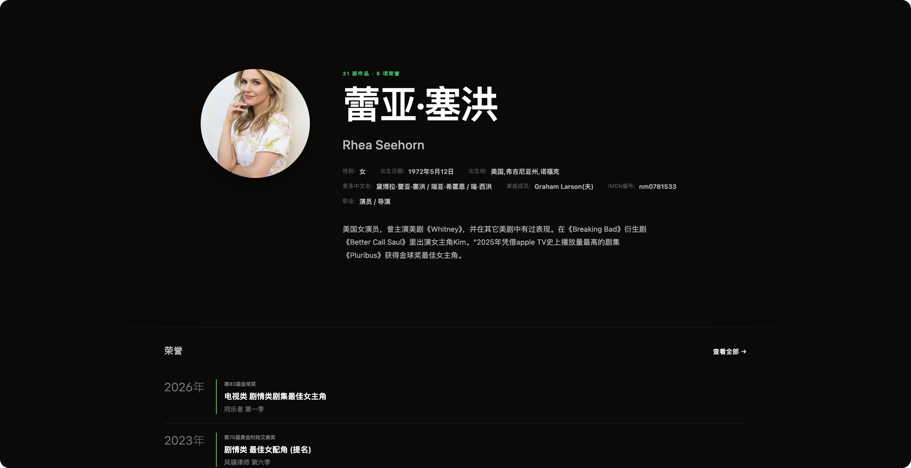

# Douban Plus

[](https://greasyfork.org/zh-CN/scripts/585771-douban-plus) [](https://scriptcat.org/zh-CN/script-show-page/6712)

Douban Plus 是适配 ScriptCat 和 Tampermonkey 的豆瓣作品详情页与人物页用户脚本。它从当前页面读取公开资料，再以 Preact 重排为沉浸式暗色界面；豆瓣原有链接、登录、标记与投票流程仍保留在其原生边界内。

 

## 功能

### 作品详情页 — `movie.douban.com/subject/*`

- **沉浸式 Hero**：海报、背景图、元数据、豆瓣与外部评分、简介及作品标记。
- **原生资料完整呈现**：导演、编剧和主演会读取"更多..."后隐藏的完整署名；豆瓣榜单中的名次与榜单链接也会显示在 Hero。
- **外部评分**：IMDb、Rotten Tomatoes 与 Metacritic 独立并行解析；缺失来源不会阻塞页面。
- **观看与媒体**：流媒体平台、首播平台、剧集信息、演职员、剧照、海报和预告片预览。
- **社区内容**：短评、影评、讨论、投票与作品标记；未登录时只承载豆瓣官方登录 iframe。
- **作品详情**：制片地区、语言、上映日期、片长、别名、IMDb ID 等完整信息。
- **作品切换器**：Sticky Navigation 中可搜索并在新标签页打开影视条目或豆瓣原生搜索。

### 人物页 — `www.douban.com/personage/*`

- **人物 Hero**：头像、姓名、外语名、职业、出生信息、个人简介等。
- **合作演员**：高频合作演员列表，显示合作次数。
- **代表作品**：作品卡片横向滚动条，可跳转至作品详情页。
- **职业时间线**：按年份排列的职业生涯轴，展示各年作品。
- **获奖记录**：历届奖项与提名列表。
- **图库**：人物照片画廊。

### 通用

- **响应式与可访问性**：适配桌面和移动视口，并尊重 `prefers-reduced-motion`。
- **登录界面主题**：豆瓣登录页自动适配暗色主题。

## 安装

### 一键安装（推荐）

通过 Greasy Fork 或 ScriptCat 一键安装：

[**Greasy Fork 安装**](https://greasyfork.org/zh-CN/scripts/585771-douban-plus) ｜ [**ScriptCat 安装**](https://scriptcat.org/zh-CN/script-show-page/6712)

需要先安装 Tampermonkey、Violentmonkey 或 Greasemonkey 等用户脚本管理器。

### 从源码构建

```bash
pnpm install
pnpm build
```

将 [`dist/douban-plus.user.js`](dist/douban-plus.user.js) 的完整内容安装到脚本管理器。随后访问 `https://movie.douban.com/subject/*` 或 `https://www.douban.com/personage/*`，脚本会自动运行。

构建产物未压缩，体积会随依赖和功能变化；以构建命令输出为准。

## 开发

```bash
git clone https://github.com/ZlatanCN/douban-plus.git
cd douban-plus
pnpm install
```

| 命令             | 用途                                         |
| ---------------- | -------------------------------------------- |
| `pnpm dev`       | 启动 Vite 开发服务器和 userscript 开发注入。 |
| `pnpm build`     | 生成 `dist/douban-plus.user.js`。            |
| `pnpm lint`      | 运行 Ultracite 与 Stylelint。                |
| `pnpm typecheck` | 检查源码和测试的 TypeScript 类型。           |
| `pnpm test`      | 运行 Vitest 单元与集成测试。                 |
| `pnpm test:e2e`  | 使用 Playwright Edge 在真实豆瓣页面执行 QA。 |

开发模式由 `vite-plugin-monkey` 注入脚本。若豆瓣页面 CSP 阻止开发注入，需要在本地浏览器环境中处理该限制。

## 架构

```text
src/
  main.ts              # userscript 入口；路由至匹配的页面模块
  modules/
    personage/         # 人物页（www.douban.com/personage/*）
      extract/          # 从豆瓣 DOM 只读解析人物资料
      presentation/     # Preact 页面组件（Hero、合作演员、作品、时间线、奖项、图库）
      runtime/          # 挂载、资料收养与粘性导航
      styles/           # 人物页专属样式
    subject/           # 作品页（movie.douban.com/subject/*）
      extract/          # 从豆瓣 DOM 只读解析作品资料
      hero/             # Hero、海报、元数据、简介和操作
      ratings/          # 豆瓣与外部评分
      media/            # 流媒体平台、演职员、剧照、推荐和剧集
      comments/         # 短评
      reviews/          # 影评/剧评
      discussions/      # 讨论区
      interest/         # 作品标记（想看/在看/看过等）
      login/            # 豆瓣官方登录 iframe 嵌入
      details/          # 作品详情信息
      search/           # 作品切换器
      voting/           # 短评/影评投票状态管理
      navigation/       # Sticky Navigation
      runtime/          # 挂载、运行时生命周期管理
      styles/           # 作品页专属样式
  shared/              # 无页面语义的 UI 组件、hooks、HTTP、缓存与 DOM 工具
  styles.css           # 唯一样式清单，保留既有级联顺序
tests/
  qa.ts                # QA / E2E 入口
  qa/                  # Playwright 场景、断言和截图流程
  screenshots/         # Hero、整页和移动端视觉回归截图
```

### 页面流程

**作品页：** `extractDoubanData()` 读取当前文档 → `mountSubject()` 创建 Preact 根节点 → `SubjectPageRuntime` 管理异步评分、首播平台、导航和媒体生命周期 → `SubjectPage` 渲染页面体验。外部评分在 `resolveAll()` 中并行获取，单个来源失败不会影响其余来源或首屏。

**人物页：** `extractPersonageProfile()` 读取当前文档 → `PersonageProfileAdoption` 等待展开完整简介 → `PersonagePage` 渲染 Hero、合作演员、作品、时间线、奖项与图库。

**登录页：** 检测到豆瓣登录 iframe 时，`installLoginFrameTheme()` 自动应用暗色主题。

### 设计原则

新增页面行为应进入所属页面模块（`modules/personage/` 或 `modules/subject/`）；只有不含页面语义的能力可进入 `src/shared/`。`src/build/` 是已退役的 DOM-builder 层，不要重建 imperative DOM UI。

## 验证

常规改动：

```bash
pnpm lint
pnpm typecheck
pnpm test
pnpm build
```

会影响真实豆瓣页面交互、截图或浏览器生命周期时，再执行：

```bash
pnpm build
pnpm test:e2e
```

E2E 会注入刚构建的 userscript，并在每个场景生成 `hero`、`full` 与 `mobile` 三张截图。

## 开源协议

[MIT](LICENSE)
