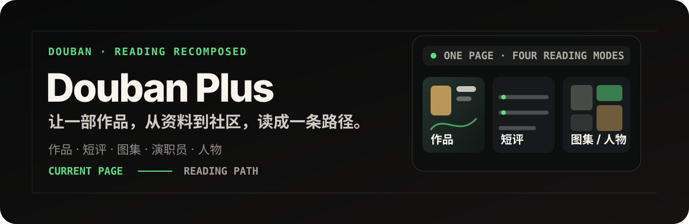
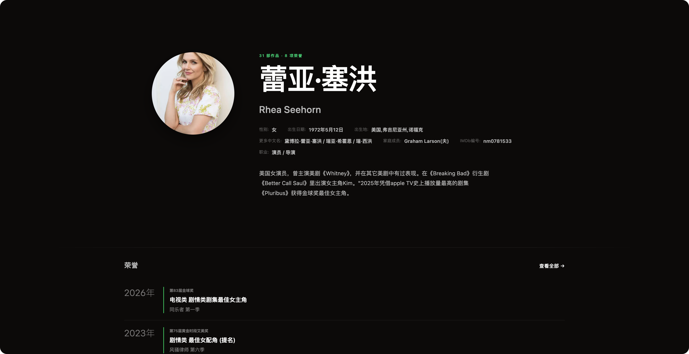
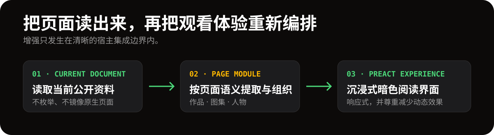

# Douban Plus

<p align="center">
  
</p>

<p align="center">
  <a href="https://greasyfork.org/zh-CN/scripts/585771-douban-plus"></a>
  <a href="https://scriptcat.org/zh-CN/script-show-page/6712"></a>
</p>

Douban Plus 是适配 ScriptCat、Tampermonkey 等脚本管理器的豆瓣增强脚本。它读取当前页面已经公开的资料，用 Preact 重组为沉浸式暗色界面；链接、登录、标记与投票仍走豆瓣原生流程。

## 看见它

真实页面，而非概念图：作品页把海报、评分、影像与社区内容组织为一条连续的观看路径；人物页从身份、关系到作品与荣誉展开。

<p align="center">
  
  
</p>

## 覆盖什么

### 作品详情页

`movie.douban.com/subject/*`

- 沉浸式 Hero：海报、背景、元数据、豆瓣与外部评分、简介及作品标记。
- 影像与观看：流媒体、首播平台、剧集信息、演职员、剧照、海报与预告片。
- 社区与资料：短评、影评、讨论、完整署名、榜单信息和详细条目资料。
- Sticky Navigation 内置作品切换器：搜索后在新标签打开豆瓣条目或原生搜索。

### 作品图集总览页

`movie.douban.com/subject/<id>/all_photos`

- 将已在页面上的剧照、海报与壁纸按原有分组重排为比例稳定的瀑布流。
- 保留原生“查看全部”和上传入口；不枚举分类页，也不抓取完整图片库。

### 演职员页

`movie.douban.com/subject/<id>/celebrities`

- 将当前作品的演职员资料按页面语义重组，并保留回到原生内容的路径。

### 人物页

`www.douban.com/personage/<id>/`

- 人物 Hero、简介、常合作的人、图片、近期与代表作品、获奖记录。
- 每个分区都保留通往豆瓣原生完整内容的出口。

## 为什么它不会变成另一套豆瓣

<p align="center">
  
</p>

- **只读当前页面**：提取已有的公开资料；数据不足时保留原生页面，而不是展示半成品。
- **按页面拆分**：作品、图集和人物各自拥有数据提取、界面与运行时边界；共享层不携带豆瓣页面语义。
- **保留原生权限与动作**：不复刻登录、上传、标记或投票服务，必要时承载或跳回豆瓣原生流程。
- **为阅读而动**：桌面与移动端都可用，并尊重 `prefers-reduced-motion`。

## 安装

### 一键安装

先安装 Tampermonkey、Violentmonkey、Greasemonkey 或 ScriptCat 等脚本管理器，然后选择一个来源：

- [从 Greasy Fork 安装](https://greasyfork.org/zh-CN/scripts/585771-douban-plus)
- [从 ScriptCat 安装](https://scriptcat.org/zh-CN/script-show-page/6712)

安装后打开作品详情页、作品图集总览页或人物主页，脚本会自动运行。

### 从源码构建

```bash
pnpm install
pnpm build
```

将 [`dist/douban-plus.user.js`](./dist/douban-plus.user.js) 的完整内容安装到脚本管理器。

## 开发

```bash
git clone https://github.com/ZlatanCN/douban-plus.git
cd douban-plus
pnpm install
pnpm dev
```

| 命令             | 用途                                         |
| ---------------- | -------------------------------------------- |
| `pnpm dev`       | 启动 Vite 开发服务器和 userscript 开发注入。 |
| `pnpm build`     | 生成 `dist/douban-plus.user.js`。            |
| `pnpm lint`      | 运行 Ultracite 与 Stylelint。                |
| `pnpm typecheck` | 检查源码和测试的 TypeScript 类型。           |
| `pnpm test`      | 运行 Vitest 单元与集成测试。                 |
| `pnpm test:e2e`  | 在真实豆瓣页面执行 Playwright QA。           |

开发模式由 `vite-plugin-monkey` 注入脚本。若豆瓣页面 CSP 阻止开发注入，需要在本地浏览器环境中处理该限制。

## 项目结构

```text
src/
  main.ts                    # 路由入口：选择匹配的页面模块
  modules/
    subject/                 # 作品详情页
    subject-all-photos/      # 作品图集总览页
    subject-celebrities/     # 演职员页
    personage/               # 人物页
  shared/                    # 无页面语义的组件、hooks、运行时与工具
  styles.css                 # 唯一样式清单
```

常规改动请运行：

```bash
pnpm lint
pnpm typecheck
pnpm test
pnpm build
```

涉及真实豆瓣页面交互、浏览器生命周期或视觉回归时，再运行：

```bash
pnpm test:e2e
```

## 开源协议

[MIT](./LICENSE)
